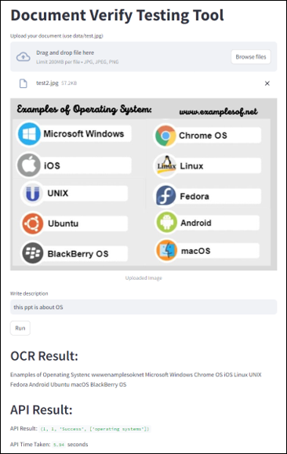

##  Document_Verify
- Streamlit service to experience document validation capabilities

### How to Use
1. Upload Document: Click on the "Upload your document" button and select an image file (use data/test.jpg for testing purposes).
2. Write Description: Enter a brief description of the document in the text input field.
3. Run Validation: Click on the "Run" button to initiate the validation process.
4. Review Results: Once the validation process is complete, the OCR result, API result, and the time taken for the API call will be displayed.

### Running the Service
- To run the service, execute the provided Python script (Document_Verify.py) in your local environment. Make sure to have Streamlit installed (pip install streamlit). The service will launch in your default web browser.

### Requirements
- Python 3.x
- Streamlit
- OCR capability (if using OCR functionality)
- Access to the document verification API

### Note
- Ensure that the necessary dependencies and access to the document verification API are set up properly for the service to function correctly. Modify the code as needed to integrate with your specific OCR and API services.

- Enjoy validating your documents with ease using the Document Verify service!

### UI example
